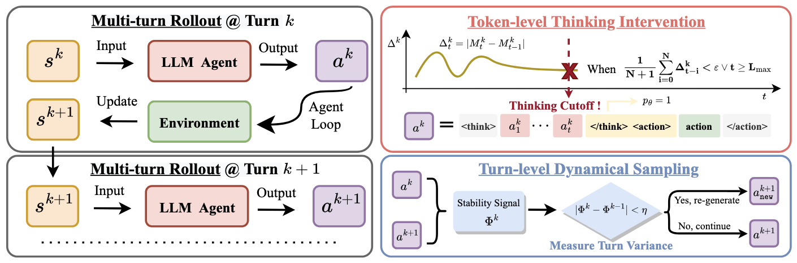

<div align="center">
 👋 Hi, everyone! 
    We will tell the world open-source agentic RL area is suffering!
    <br>
    <br>
</div>


<h1 style="text-align: center;"> 🤖 Agentic RL Arena </h1>


<p align="center"></p>
<p align="center" style="font-size: 16px; max-width: 800px; margin: 0 auto;">
Figure 1: Overview of our framework
</p>

Recent progress in multi-turn RL has significantly improved reasoning LLMs' performances on complex interactive tasks. Despite advances in stabilization techniques such as fine-grained credit assignment and trajectory filtering, instability remains pervasive and often leads to training collapse.
We argue that this instability stems from inefficient exploration in multi-turn settings, where policies continue to generate low-information actions that neither reduce uncertainty nor advance task progress.

To address this issue, we propose Token- and Turn-level Policy Optimization (T^2PO), an uncertainty-aware framework that explicitly controls exploration at fine-grained levels.

## Our Framework Design

- At the token level, (T^2PO) monitors uncertainty dynamics and triggers a thinking intervention once  the marginal uncertainty change falls below a threshold. 

- At the turn level, (T^2PO) identifies interactions with negligible exploration progress and dynamically resamples such turns to avoid wasted rollouts. 

- We evaluate (T^2PO) in diverse environments, including WebShop, ALFWorld, and Search QA, demonstrating substantial gains in training stability and performance improvements with better exploration efficiency.

### 🔥 Key Features

- ✅ Support Training Multi-turn Embody Agents
- ✅ Support Training Multi-turn Search Agents
- ✅ Support Training Multi-turn Multi-modal Game Agents
- ✅ Support Training Multi-turn Web Agents
- ✅ Support Evaluating Commerical LLMs as Agents


## 💡 Getting Started


Our benchmark is based on the following main dependencies:

```python
Python=3.11, VeRL=0.4.0, PyTorch=2.6.0, and vLLM=0.8.5
```

<!-- You can install other requirements as follows:
``` bash
# Install conda (Optional if conda exists)
bash set_conda.sh

# Install foundational dependencies 
bash setup_env.sh

# Install dependencies for specific tasks
conda activate verl
pip install -r requirements_xxx.txts
``` -->
## 🚀 Existing Support

> ### 🤖 **Embodied Agents**
```bash
# 1. Build the environments
bash prepare_all_embody.sh

# 2. Run the demo code with:
conda activate agentrl_embody
bash examples/world_agent_trainer/train_xxx.sh

```

> ### 🛒 **Web Agents**

<!-- ```bash
# Behavior Cloning, call bedrock api to collect data
python recipe/webshop/data_sft.py

``` -->

```bash
# 1. Build the webshop environments
bash prepare_all_web.sh

# 2. Run the demo code with:
conda activate agentrl_web
bash examples/shop_agent_trainer/train_xxxx.sh
```

> ### 🕸️ **Search Agents**

```bash
#! 1. Build the RAG server environments
bash prepare_all_search.sh


# 2. Run the demo code with:
conda activate agentrl_search
bash examples/search_agent_trainer/train_xxx.sh
```

> ### 🧮 **Math+CI**

1. We use Sandbox Fusion as an asynchronous code interpreter. You can follow the [Guidance](sandbox/README.md) to run the CI.

2. The training datasets are Math3-5 from SimpleRL and Deepscaler in `datasets`.

```bash
# 3. Install the requirements
bash prepare_all_science.sh

# 4. Run the demo code with:
conda activate agentrl_science
bash examples/simpletir_trainer/train_grpo.sh
```

> ### 🎮 **OpenAI Game Agents**

```bash
# 1. Install the requirements
bash prepare_all_game.sh

# 2. Run the demo code with:
bash examples/game_agent_trainer/train_xxx.sh
```


## 🌊 Easy Extension

🔹 All of the methods utilized is in `recipe`, you can warp the verl worker for your code to join our codebase. The folder under `recipe` can represent either a method for different tasks or a series methods for one task. You can refer to [Easy Extension](docs/extension.md) for examples.

🔹 All of the environments utilized is in `agent_system`, you can warp the env for your code to join our codebase.

🔹 Add specific dependencies to `requirements_xxx.txt`

🔹 Feel free to add the folder of the third-party tools, e.g., `AgentRL/sandbox` for code implementation.


## 📊 Further Analysis


<!-- 

```bash
# Install requiremnet
pip install mlflow

# Start server
mlflow server \
  --host 0.0.0.0 --port 5000 \
  --backend-store-uri sqlite:////tmp/mlruns.db \
  --default-artifact-root /tmp/mlruns

export MLFLOW_TRACKING_URI=http://127.0.0.1:5000

actor_rollout_ref.rollout.trace.backend: mlflow  # or weave
actor_rollout_ref.rollout.trace.token2text: True
trainer.logger: ['console', 'mlflow']
``` -->

## 🎆 Awesome work for reference

- [TinyZero](https://github.com/Jiayi-Pan/TinyZero): a reproduction of **DeepSeek R1 Zero** recipe for reasoning tasks 
- [SkyThought](https://github.com/NovaSky-AI/SkyThought): RL training for Sky-T1-7B by NovaSky AI team. 
- [simpleRL-reason](https://github.com/hkust-nlp/simpleRL-reason): SimpleRL-Zoo: Investigating and Taming Zero Reinforcement Learning for Open Base Models in the Wild 
- [Easy-R1](https://github.com/hiyouga/EasyR1): **Multi-modal** RL training framework 
- [OpenManus-RL](https://github.com/OpenManus/OpenManus-RL): LLM Agents RL tunning framework for multiple agent environments. 
- [rllm](https://github.com/agentica-project/rllm): async RL training with [verl-pipeline](https://github.com/agentica-project/verl-pipeline) 
- [PRIME](https://github.com/PRIME-RL/PRIME): Process reinforcement through implicit rewards 
- [RAGEN](https://github.com/ZihanWang314/ragen): a general-purpose reasoning **agent** training framework 
- [Logic-RL](https://github.com/Unakar/Logic-RL): a reproduction of DeepSeek R1 Zero on 2K Tiny Logic Puzzle Dataset. 
- [Search-R1](https://github.com/PeterGriffinJin/Search-R1): RL with reasoning and **searching (tool-call)** interleaved LLMs 
- [DeepRetrieval](https://github.com/pat-jj/DeepRetrieval): RL Training of **Search Agent** with **Search/Retrieval Outcome** 
- [ReSearch](https://github.com/Agent-RL/ReSearch): Learning to **Re**ason with **Search** for LLMs via Reinforcement Learning 
- [Code-R1](https://github.com/ganler/code-r1): Reproducing R1 for **Code** with Reliable Rewards 
- [Skywork-OR1](https://github.com/SkyworkAI/Skywork-OR1): Skywork open reaonser series 
- [ToRL](https://github.com/GAIR-NLP/ToRL): Scaling tool-integrated RL 
- [verl-agent](https://github.com/langfengQ/verl-agent): A scalable training framework for **long-horizon LLM/VLM agents**, along with a new algorithm **GiGPO** 
- [PF-PPO](https://arxiv.org/abs/2409.06957): Policy Filtration for PPO based on the reliability of reward signals for more efficient and robust RLHF.
- [GUI-R1](https://github.com/ritzz-ai/GUI-R1): **GUI-R1**: A Generalist R1-style Vision-Language Action Model For **GUI Agents** 
- [DeepResearcher](https://github.com/GAIR-NLP/DeepResearcher): Scaling deep research via reinforcement learning in real-world environments 
- [VAGEN](https://github.com/RAGEN-AI/VAGEN): Training VLM agents with multi-turn reinforcement learning 
- [ReTool](https://retool-rl.github.io/): ReTool: reinforcement learning for strategic tool use in LLMs
- [Seed-Coder](https://github.com/ByteDance-Seed/Seed-Coder): RL training of Seed-Coder boosts performance on competitive programming 
- [all-hands/openhands-lm-32b-v0.1](https://www.all-hands.dev/blog/introducing-openhands-lm-32b----a-strong-open-coding-agent-model): A strong, open coding agent model, trained with [multi-turn fine-tuning](https://github.com/volcengine/verl/pull/195)
- [RM-R1](https://arxiv.org/abs/2505.02387): RL training of reasoning reward models 
- [Absolute Zero Reasoner](https://arxiv.org/abs/2505.03335): A no human curated data self-play framework for reasoning
- [LUFFY](https://arxiv.org/pdf/2504.14945): Learning to Reason under Off-Policy Guidance
- [verl-tool](https://github.com/TIGER-AI-Lab/verl-tool): An unified and easy-to-extend tool-agent training framework based on verl
- [DeepMath](https://github.com/zwhe99/DeepMath): DeepMath-103K data and series models for math reasoning
